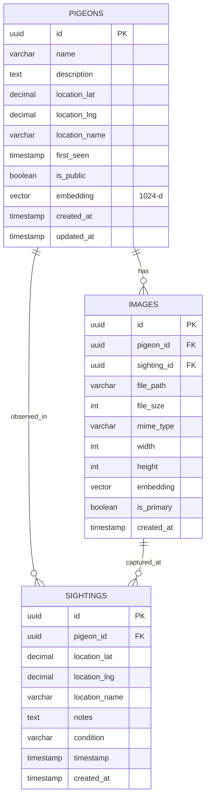

# Datenbank Schema Dokumentation

Diese Dokumentation beschreibt das PostgreSQL-Schema für den KI Tauben Scanner, inklusive Tabellen, Indizes, Views und gespeicherten Funktionen.

**Datenbank:** PostgreSQL 15+ mit pgvector Extension

**Architektur:** Embeddings werden serverseitig im Backend generiert (MobileNet-V2) und in PostgreSQL gespeichert.

**Haupttabellen:**
- `pigeons` - Registrierte Tauben mit 1024-d Embedding
- `images` - Zusätzliche Bilder (optional)
- `sightings` - Sichtungen

---

## 📊 Entity Relationship Diagram



---

## 📋 Tabellen

### pigeons

Die Haupttabelle für registrierte Tauben. Jede Taube erhält einen eindeutigen UUID-Primärschlüssel und ein 1024-dimensionales Embedding für KI-basierte Bilderkennung.

#### Schema

```sql
CREATE TABLE pigeons (
    id UUID PRIMARY KEY DEFAULT uuid_generate_v4(),
    name VARCHAR(255) NOT NULL,
    description TEXT,
    
    -- Location
    location_lat DECIMAL(10, 8),
    location_lng DECIMAL(11, 8),
    location_name VARCHAR(255),
    
    -- Metadata
    first_seen TIMESTAMP WITH TIME ZONE DEFAULT NOW(),
    is_public BOOLEAN DEFAULT true,
    
    -- AI embedding
    embedding vector(1024),
    
    -- Timestamps
    created_at TIMESTAMP WITH TIME ZONE DEFAULT NOW(),
    updated_at TIMESTAMP WITH TIME ZONE DEFAULT NOW()
);
```

#### Felder

| Feld | Typ | Nullable | Default | Beschreibung |
|------|-----|----------|---------|--------------|
| `id` | UUID | ❌ | auto | Eindeutige ID |
| `name` | VARCHAR(255) | ❌ | - | Name der Taube |
| `description` | TEXT | ✅ | null | Beschreibung |
| `location_lat` | DECIMAL(10,8) | ✅ | null | Breitengrad |
| `location_lng` | DECIMAL(11,8) | ✅ | null | Längengrad |
| `location_name` | VARCHAR(255) | ✅ | null | Ortsname |
| `first_seen` | TIMESTAMP | ✅ | NOW() | Erste Sichtung |
| `is_public` | BOOLEAN | ✅ | true | Öffentlich sichtbar |
| `embedding` | vector(1024) | ✅ | null | KI-Feature-Vector |
| `created_at` | TIMESTAMP | ✅ | NOW() | Erstellungsdatum |
| `updated_at` | TIMESTAMP | ✅ | NOW() | Letzte Änderung |

---

### images

Speichert alle Bilder, die mit Tauben oder Sichtungen verbunden sind. Unterstützt mehrere Bilder pro Taube und pro Sichtung für Multi-View Matching.

#### Schema

```sql
CREATE TABLE images (
    id UUID PRIMARY KEY DEFAULT uuid_generate_v4(),
    pigeon_id UUID REFERENCES pigeons(id) ON DELETE CASCADE,
    sighting_id UUID,
    
    -- Image metadata
    file_path VARCHAR(500) NOT NULL,
    file_size INTEGER NOT NULL,
    mime_type VARCHAR(100) NOT NULL,
    width INTEGER,
    height INTEGER,
    
    -- AI embedding
    embedding vector(1024),
    
    -- Flags
    is_primary BOOLEAN DEFAULT false,
    
    -- Timestamps
    created_at TIMESTAMP WITH TIME ZONE DEFAULT NOW()
);
```

#### Felder

| Feld | Typ | Nullable | Default | Beschreibung |
|------|-----|----------|---------|--------------|
| `id` | UUID | ❌ | auto | Eindeutige ID |
| `pigeon_id` | UUID | ✅ | null | Verknüpfte Taube (FK) |
| `sighting_id` | UUID | ✅ | null | Verknüpfte Sichtung (FK) |
| `file_path` | VARCHAR(500) | ❌ | - | Pfad zur Datei |
| `file_size` | INTEGER | ❌ | - | Dateigröße in Bytes |
| `mime_type` | VARCHAR(100) | ❌ | - | MIME-Typ |
| `width` | INTEGER | ✅ | null | Bildbreite |
| `height` | INTEGER | ✅ | null | Bildhöhe |
| `embedding` | vector(1024) | ✅ | null | KI-Feature-Vector |
| `is_primary` | BOOLEAN | ✅ | false | Primärbild der Taube |
| `created_at` | TIMESTAMP | ✅ | NOW() | Erstellungsdatum |

#### Fremdschlüssel

```sql
ALTER TABLE images 
ADD CONSTRAINT images_sighting_fk 
FOREIGN KEY (sighting_id) REFERENCES sightings(id) ON DELETE CASCADE;
```

---

### sightings

Erfasst Sichtungen von registrierten Tauben an verschiedenen Standorten und Zeiten.

#### Schema

```sql
CREATE TABLE sightings (
    id UUID PRIMARY KEY DEFAULT uuid_generate_v4(),
    pigeon_id UUID REFERENCES pigeons(id) ON DELETE CASCADE,
    
    -- Location
    location_lat DECIMAL(10, 8),
    location_lng DECIMAL(11, 8),
    location_name VARCHAR(255),
    
    -- Observation
    notes TEXT,
    condition VARCHAR(100),
    
    -- Timestamps
    timestamp TIMESTAMP WITH TIME ZONE DEFAULT NOW(),
    created_at TIMESTAMP WITH TIME ZONE DEFAULT NOW()
);
```

#### Felder

| Feld | Typ | Nullable | Default | Beschreibung |
|------|-----|----------|---------|--------------|
| `id` | UUID | ❌ | auto | Eindeutige ID |
| `pigeon_id` | UUID | ✅ | null | Verknüpfte Taube (FK) |
| `location_lat` | DECIMAL(10,8) | ✅ | null | Breitengrad |
| `location_lng` | DECIMAL(11,8) | ✅ | null | Längengrad |
| `location_name` | VARCHAR(255) | ✅ | null | Ortsname |
| `notes` | TEXT | ✅ | null | Notizen |
| `condition` | VARCHAR(100) | ✅ | null | Zustand (healthy, injured, unknown) |
| `timestamp` | TIMESTAMP | ✅ | NOW() | Zeit der Sichtung |
| `created_at` | TIMESTAMP | ✅ | NOW() | Erstellungsdatum |

---

## 📈 Indizes

### HNSW Index für Vektor-Suche

**Tabelle:** `pigeons`
**Typ:** HNSW (Hierarchical Navigable Small World)
**Verwendung:** Schnelle Cosine Similarity Search

```sql
CREATE INDEX pigeons_embedding_idx ON pigeons 
USING hnsw (embedding vector_cosine_ops)
WITH (m = 16, ef_construction = 64);
```

**Parameter:**
- `m = 16`: Ausgehende Kanten pro Knoten (höher = bessere Qualität, mehr Speicher)
- `ef_construction = 64`: Konstruktionszeit-Genauigkeit (höher = bessere Qualität, langsamerer Index-Aufbau)

**Tabelle:** `images`
**Verwendung:** Multi-View Matching

```sql
CREATE INDEX images_embedding_idx ON images 
USING hnsw (embedding vector_cosine_ops)
WITH (m = 16, ef_construction = 64);
```

---

### GIN Index für Full-Text Search

**Tabelle:** `pigeons`
**Typ:** GIN (Generalized Inverted Index)
**Verwendung:** Case-insensitive Suche nach Namen

```sql
CREATE INDEX pigeons_name_search_idx ON pigeons 
USING gin(to_tsvector('german', name));
```

**Verwendung:**
```sql
-- Suche nach Namen (German stemming)
SELECT * FROM pigeons 
WHERE to_tsvector('german', name) @@ plainto_tsquery('german', 'Rudi');
```

---

### Spatial Index (GiST)

**Tabelle:** `pigeons`
**Typ:** GiST (Generalized Search Tree)
**Verwendung:** Geografische Nachbarschaftssuche

```sql
CREATE INDEX pigeons_location_idx ON pigeons 
USING gist(point(location_lng, location_lat));
```

**Tabelle:** `sightings`

```sql
CREATE INDEX sightings_location_idx ON sightings 
USING gist(point(location_lng, location_lat));
```

---

### B-Tree Indizes

```sql
-- Schnelle Lookups nach pigeon_id
CREATE INDEX images_pigeon_idx ON images(pigeon_id);
CREATE INDEX sightings_pigeon_idx ON sightings(pigeon_id);

-- Sortierung nach Datum
CREATE INDEX sightings_timestamp_idx ON sightings(timestamp DESC);
```

---

## 👁️ Views

### pigeons_with_stats

Aggregierte View mit Statistiken pro Taube.

```sql
CREATE VIEW pigeons_with_stats AS
SELECT 
    p.id,
    p.name,
    p.description,
    p.location_lat,
    p.location_lng,
    p.location_name,
    p.first_seen,
    p.is_public,
    p.created_at,
    p.updated_at,
    COUNT(DISTINCT s.id) as sightings_count,
    COUNT(DISTINCT i.id) as images_count,
    MAX(s.timestamp) as last_seen
FROM pigeons p
LEFT JOIN sightings s ON p.id = s.pigeon_id
LEFT JOIN images i ON p.id = i.pigeon_id
GROUP BY p.id;
```

**Verwendung:**
```sql
-- Alle Tauben mit Statistiken
SELECT * FROM pigeons_with_stats 
WHERE sightings_count > 5 
ORDER BY last_seen DESC;
```

**Ergebnis:**
| id | name | sightings_count | images_count | last_seen |
|-----|------|-----------------|--------------|-----------|
| uuid | Rudi | 5 | 2 | 2024-01-15 |

---

## ⚙️ Funktionen

### find_similar_pigeons()

Gespeicherte Funktion zur Ähnlichkeitssuche mit anpassbarem Threshold.

```sql
CREATE OR REPLACE FUNCTION find_similar_pigeons(
    query_embedding vector(1024),
    match_threshold FLOAT DEFAULT 0.80,
    max_results INTEGER DEFAULT 10
)
RETURNS TABLE (
    id UUID,
    name VARCHAR(255),
    description TEXT,
    similarity FLOAT
) AS $$
BEGIN
    RETURN QUERY
    SELECT 
        p.id,
        p.name,
        p.description,
        (1 - (p.embedding <=> query_embedding))::FLOAT as similarity
    FROM pigeons p
    WHERE p.embedding IS NOT NULL
      AND (1 - (p.embedding <=> query_embedding)) >= match_threshold
    ORDER BY p.embedding <=> query_embedding
    LIMIT max_results;
END;
$$ LANGUAGE plpgsql;
```

**Verwendung:**

```sql
-- Ähnliche Tauben finden
SELECT * FROM find_similar_pigeons(
    '[0.1, -0.2, 0.3, ...]'::vector(1024),  -- Dein 1024-d Vektor
    0.80,  -- Threshold
    5      -- Max Ergebnisse
);
```

**Ergebnis:**
| id | name | description | similarity |
|----|------|-------------|------------|
| uuid | Rudi | Rote Federn | 0.92 |
| uuid | Helga | Grauer Kopf | 0.84 |

---

## 🔄 Trigger

### Automatische updated_at Aktualisierung

```sql
CREATE OR REPLACE FUNCTION update_updated_at_column()
RETURNS TRIGGER AS $$
BEGIN
    NEW.updated_at = NOW();
    RETURN NEW;
END;
$$ language 'plpgsql';

CREATE TRIGGER update_pigeons_updated_at 
    BEFORE UPDATE ON pigeons 
    FOR EACH ROW 
    EXECUTE FUNCTION update_updated_at_column();
```

---

## 📝 Beispiel-Queries

### 1. Taube mit allen Bildern und Sichtungen

```sql
SELECT 
    p.id,
    p.name,
    p.description,
    json_agg(DISTINCT jsonb_build_object(
        'id', i.id,
        'path', i.file_path,
        'is_primary', i.is_primary
    )) as images,
    json_agg(DISTINCT jsonb_build_object(
        'id', s.id,
        'timestamp', s.timestamp,
        'location', s.location_name
    )) as sightings
FROM pigeons p
LEFT JOIN images i ON p.id = i.pigeon_id
LEFT JOIN sightings s ON p.id = s.pigeon_id
WHERE p.id = '550e8400-e29b-41d4-a716-446655440000'
GROUP BY p.id;
```

### 2. Bild-Matching mit ähnlichsten Tauben

```sql
WITH query AS (
    SELECT '[0.1, 0.2, ...]'::vector(1024) as vec
)
SELECT 
    p.id,
    p.name,
    (1 - (p.embedding <=> query.vec))::float as similarity
FROM pigeons p, query
WHERE p.embedding IS NOT NULL
  AND (1 - (p.embedding <=> query.vec)) >= 0.80
ORDER BY p.embedding <=> query.vec
LIMIT 10;
```

### 3. Sichtungen in der Nähe eines Punktes

```sql
-- Sichtungen innerhalb von 1km
SELECT 
    s.id,
    s.notes,
    s.timestamp,
    p.name as pigeon_name,
    ST_Distance(
        ST_SetSRID(ST_MakePoint(s.location_lng, s.location_lat), 4326)::geography,
        ST_SetSRID(ST_MakePoint(13.4050, 52.5200), 4326)::geography
    ) / 1000 as distance_km
FROM sightings s
JOIN pigeons p ON s.pigeon_id = p.id
WHERE s.location_lat IS NOT NULL 
  AND s.location_lng IS NOT NULL
  AND ST_DWithin(
        ST_SetSRID(ST_MakePoint(s.location_lng, s.location_lat), 4326)::geography,
        ST_SetSRID(ST_MakePoint(13.4050, 52.5200), 4326)::geography,
        1000  -- Meter
    )
ORDER BY distance_km;
```

### 4. Populäre Tauben (meiste Sichtungen)

```sql
SELECT 
    p.id,
    p.name,
    COUNT(s.id) as sighting_count,
    MAX(s.timestamp) as last_seen
FROM pigeons p
LEFT JOIN sightings s ON p.id = s.pigeon_id
GROUP BY p.id
ORDER BY sighting_count DESC
LIMIT 10;
```

### 5. Sichtungen pro Monat

```sql
SELECT 
    DATE_TRUNC('month', s.timestamp) as month,
    COUNT(*) as sightings_count,
    COUNT(DISTINCT s.pigeon_id) as unique_pigeons
FROM sightings s
GROUP BY DATE_TRUNC('month', s.timestamp)
ORDER BY month DESC;
```

### 6. Neue Tauben ohne Bild

```sql
SELECT 
    p.id,
    p.name,
    p.created_at
FROM pigeons p
LEFT JOIN images i ON p.id = i.pigeon_id
WHERE i.id IS NULL;
```

---

## 🔧 Performance-Optimierung

### VACUUM und ANALYZE

```sql
-- Regelmäßig ausführen
VACUUM ANALYZE pigeons;
VACUUM ANALYZE images;
VACUUM ANALYZE sightings;
```

### Index-Statistiken

```sql
-- Größe aller Indizes anzeigen
SELECT 
    schemaname,
    tablename,
    indexname,
    pg_size_pretty(pg_relation_size(indexname::regclass)) as index_size
FROM pg_indexes
WHERE tablename IN ('pigeons', 'images', 'sightings')
ORDER BY pg_relation_size(indexname::regclass) DESC;
```

---

## 📦 Extensions

Benötigte PostgreSQL Extensions:

```sql
-- UUID Generierung
CREATE EXTENSION IF NOT EXISTS "uuid-ossp";

-- Vektor-Operationen
CREATE EXTENSION IF NOT EXISTS "vector";

-- Optional: PostGIS für erweiterte Geografiefunktionen
CREATE EXTENSION IF NOT EXISTS "postgis";
```

---

## 🔄 Backup & Restore

### SQL-Dump erstellen

```bash
pg_dump -h localhost -U tauben -d tauben_scanner \
  --no-owner --no-acl \
  -f tauben_scanner_backup.sql
```

### Restore

```bash
psql -h localhost -U tauben -d tauben_scanner \
  -f tauben_scanner_backup.sql
```

### Spezifische Tabelle exportieren

```bash
pg_dump -h localhost -U tauben -d tauben_scanner \
  --table=pigeons --data-only \
  -f pigeons_data.sql
```

---

## 📊 Monitoring Queries

### Datenbankgröße

```sql
SELECT 
    schemaname,
    tablename,
    pg_size_pretty(pg_total_relation_size(tablename::regclass)) as total_size
FROM pg_tables
WHERE tablename IN ('pigeons', 'images', 'sightings')
ORDER BY pg_total_relation_size(tablename::regclass) DESC;
```

### Aktive Verbindungen

```sql
SELECT 
    pid,
    usename,
    application_name,
    client_addr,
    state,
    query_start,
    query
FROM pg_stat_activity
WHERE datname = 'tauben_scanner';
```

---

**Zurück zur [Hauptdokumentation](../README.md)**
